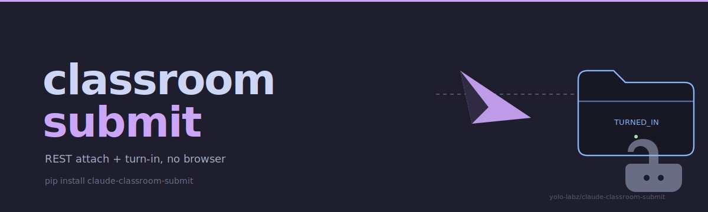

<picture>
  <source media="(prefers-color-scheme: dark)" srcset="docs/assets/hero-dark.svg">
  <source media="(prefers-color-scheme: light)" srcset="docs/assets/hero-light.svg">
  
</picture>

# claude-classroom-submit

**Atomic Google Classroom submission via REST API** — bypass the cross-origin Drive Picker iframe that blocks browser automation, and go straight to the `modifyAttachments` + `turnIn` API calls.

[](https://docs.claude.com/en/docs/claude-code/plugins)
[](https://www.python.org/)
[](skills/classroom-submit/classroom.py)
[](LICENSE)

---

## Capability

**Pattern.** Google Classroom submission via the official REST API — one `classroom-submit` call resolves the OAuth installed-app token, drops the file into Google Drive via rclone, calls `courses.courseWork.studentSubmissions.modifyAttachments`, and finalizes with `turnIn` in a single atomic flow.

**Trade-off.** One-time OAuth 2.0 installed-app flow setup (~5 minutes: Cloud project → Classroom API enable → Desktop client → consent screen) in exchange for bypassing the cross-origin Drive Picker iframe entirely. Every subsequent submit is a single `classroom-submit submit-file` call, ~10 seconds end-to-end, no browser involved.

**Use when.** A shell pipeline, cron job, or Claude Code plugin needs to attach a local file to a Classroom assignment and turn it in — without driving a browser, without scripting the picker UI, and without the `event.isTrusted === false` rejection that blocks every synthetic click into the picker iframe.

```bash
pip install claude-classroom-submit
classroom-submit --file homework.pdf --assignment "Lista 3"
```

## Demo

A non-interactive 16-second `asciinema` cast covering `classroom-submit --help`, `classroom-submit find "Lista 3"`, `classroom-submit submit-file ...` (full upload → attach → turn-in flow, ~3 s API roundtrip), the `already_turned_in` exit-code-5 guard, and `classroom-submit status` is checked into the repo at [`docs/assets/classroom-demo.cast`](./docs/assets/classroom-demo.cast). Replay locally:

```bash
asciinema play docs/assets/classroom-demo.cast
```

A hosted player embed will land in a follow-up PR after the cast is uploaded to `asciinema.org`.

## How `claude-classroom-submit` compares

The Classroom web client uses a **Drive Picker iframe** (`drive.google.com/picker` embedded in `classroom.google.com`) for file attachments — a hard wall for every automation that tries to finish a submission from the browser side.

| Capability                                 | `claude-classroom-submit` | Drive Picker iframe (web UI) |
|--------------------------------------------|:---:|:---:|
| Cross-origin iframe bypass                 | REST API direct           | blocked (Same-Origin Policy) |
| Pure Python stdlib (`urllib`, `http.server`, `json`) | zero third-party deps | n/a (requires browser) |
| OAuth 2.0 installed-app flow               | one-time setup            | per-session interactive consent |
| End-to-end submit                          | ~10 s                     | ~30 s+ manual click-through |
| Atomic `modifyAttachments` + `turnIn`      | single call, fails closed | two manual UI steps |
| `TURNED_IN` state guard                    | exit code 5 if already final | none (silent overwrite) |
| PEP 740 attestations on PyPI               | yes                       | n/a |
| Minimal scopes (`.coursework.me`, no grade book) | yes                 | full session cookie surface |
| Works headless / CI / Claude Code plugin   | yes                       | no (browser-driven) |

---

## The problem

Google Classroom's web client uses a **Drive Picker iframe** (hosted at `drive.google.com/picker`) for file attachments. That iframe is cross-origin to `classroom.google.com`, so:

- Parent-page JavaScript can't reach into it (Same-Origin Policy)
- `Trusted Types` blocks `innerHTML` injection
- AppleScript mouse clicks require macOS Accessibility permission that `osascript` typically lacks
- Synthetic `DragEvent`s are rejected because `event.isTrusted === false`
- `document.execCommand('insertHTML')` throws "This document requires TrustedHTML assignment"

As a result, any Claude Code workflow that tries to **actually finish a Classroom submission** gets stuck at the picker. You can write the deliverable, compile the PDF, stage the Drive file, open the tab, even arm the picker — but you can't click the file inside the picker iframe, and you can't click "Entregar".

This plugin solves that by never touching the picker at all.

## The solution

Instead of scripting the UI, `claude-classroom-submit` speaks the [Google Classroom REST API](https://developers.google.com/classroom/reference/rest) directly:

1. **Upload** the file to the user's Google Drive via rclone (FUSE mount preferred, `rclone copy` as fallback).
2. **Discover** the Drive file ID from `rclone lsjson --original`.
3. **Find** the target assignment via `courses.courseWork.list` + title substring match.
4. **Attach** via `courses.courseWork.studentSubmissions.modifyAttachments` with `{"addAttachments": [{"driveFile": {"id": <id>}}]}`.
5. **Turn in** via `courses.courseWork.studentSubmissions.turnIn`.

All five steps run in a single `classroom-lib.sh submit-file` call, take ~10 seconds end-to-end, and never open a browser.

## Features

- **Zero third-party Python dependencies** — 600 lines of pure stdlib (`urllib`, `http.server`, `json`, `subprocess`). No `google-auth`, no `requests`, no `google-api-python-client`. Reproducible on NixOS, Alpine, whatever.
- **OAuth 2.0 Installed App flow** with loopback redirect (`http://localhost:8765`) and automatic access-token refresh.
- **Minimal scopes** — only `classroom.courses.readonly` + `classroom.coursework.me`. The plugin cannot read other students' work, cannot touch the grade book, cannot send messages.
- **Atomic submit** — `modifyAttachments` + `turnIn` in one call, with a hard check for `TURNED_IN` state to prevent double-submissions.
- **Natural-language query search** — `find "Airbnb"` walks every active course and returns every assignment whose title or description contains "Airbnb". No need to memorize course IDs.
- **Rclone-native** — reuses the user's existing rclone Drive remote (default: `gdrive-uni:Classroom-Submissions-2026.1`), prefers the local FUSE mount for instant uploads.
- **Claude Code plugin** — integrates as a skill + three slash commands (`/classroom-auth`, `/classroom-find`, `/classroom-submit`), auto-triggers when the user asks to submit to Classroom.
- **shellcheck + shfmt clean**, matches the conventions of [claude-mac-chrome](https://github.com/yolo-labz/claude-mac-chrome).

## Installation

### As a Claude Code plugin

```bash
# In Claude Code, run:
/plugin install https://github.com/yolo-labz/claude-classroom-submit
```

Or install locally for development:

```bash
git clone https://github.com/yolo-labz/claude-classroom-submit
# Register as a local plugin via Claude Code's plugin.json:
#   "<path/to/claude-classroom-submit>"
```

### As a standalone CLI

```bash
alias classroom='<path/to/claude-classroom-submit>/skills/classroom-submit/classroom-lib.sh'
classroom help
```

## Setup (one-time)

Before first use, create a Google Cloud project and an OAuth 2.0 Desktop client. Full walkthrough: [`docs/google-cloud-setup.md`](docs/google-cloud-setup.md). Summary:

1. <https://console.cloud.google.com/projectcreate> → new project
2. Enable Classroom API: <https://console.cloud.google.com/apis/library/classroom.googleapis.com>
3. Configure OAuth consent screen (External, add your email as a test user, add 3 scopes)
4. Create OAuth client → Desktop app → download JSON
5. Save as `~/.config/claude-classroom-submit/credentials.json`
6. `classroom-lib.sh auth` — opens browser, grants consent, saves tokens

After step 6, every subsequent call is autonomous.

## Usage

### Find an assignment

```bash
classroom-lib.sh find "Airbnb" --terse
# ODUxMzc0NzU3ODU3  Nzk3MDIxMjk3MjU4  2026-04-07  AD432 - Estratégia...  Atividade 2 - O caso da empresa Airbnb
```

### Submit a file (one shot)

```bash
classroom-lib.sh submit-file ~/Documents/atividade2-airbnb.pdf --query "Airbnb"
```

Output:

```json
{
  "submission_id": "Cg4I6P_…",
  "course_id": "ODUxMzc0NzU3ODU3",
  "coursework_id": "Nzk3MDIxMjk3MjU4",
  "drive_file_id": "1Pg_YdVT-NRmiKoAacz1Sf21XJ-MX4vRJ",
  "state": "TURNED_IN",
  "title": "Atividade 2 - O caso da empresa Airbnb",
  "file": "atividade2-airbnb.pdf"
}
```

### Submit with explicit IDs (skip search)

```bash
classroom-lib.sh submit-file ~/file.pdf --course ODUxMzc0NzU3ODU3 --coursework Nzk3MDIxMjk3MjU4
```

### Attach without turning in (draft mode)

```bash
classroom-lib.sh submit-file ~/file.pdf --query "Airbnb" --attach-only
```

### Step-by-step (file already in Drive)

```bash
# You have the Drive file ID from rclone lsjson or elsewhere
classroom-lib.sh submit <course_id> <coursework_id> <drive_file_id>
```

### From inside Claude Code

The plugin registers three slash commands:

- `/claude-classroom-submit:classroom-auth` — one-time OAuth
- `/claude-classroom-submit:classroom-find <query>` — search assignments
- `/claude-classroom-submit:classroom-submit <file-path> <query>` — atomic submit

When the user asks Claude to "submit X to Classroom", Claude auto-discovers this plugin via the `classroom-submit` skill and runs the right command without requiring the user to invoke the slash command manually.

## Exit codes (stable contract)

| Code | Meaning                           |
|------|-----------------------------------|
| `0`  | success                           |
| `1`  | generic error                     |
| `2`  | setup required (credentials/auth) |
| `3`  | Classroom API error (4xx/5xx)     |
| `4`  | not found                         |
| `5`  | already turned in                 |

## Environment overrides

| Variable                           | Default                                                       |
|------------------------------------|---------------------------------------------------------------|
| `CLASSROOM_SUBMIT_CONFIG_DIR`      | `$XDG_CONFIG_HOME/claude-classroom-submit`                    |
| `CLASSROOM_SUBMIT_RCLONE_REMOTE`   | `gdrive-uni:Classroom-Submissions-2026.1`                     |
| `CLASSROOM_SUBMIT_RCLONE_MOUNT`    | `$HOME/GoogleDrive-Uni/Classroom-Submissions-2026.1`          |
| `CLASSROOM_SUBMIT_OAUTH_PORT`      | `8765`                                                        |
| `CLASSROOM_SUBMIT_PYTHON`          | (auto-detect `python3` / `python`)                            |

Persistent overrides live in `~/.config/claude-classroom-submit/config.json`:

```json
{
  "rclone_remote": "gdrive-work:ClassroomDropbox",
  "rclone_mount_path": "$HOME/GDriveWork/ClassroomDropbox"
}
```

## Security

- **Local tokens only** — `tokens.json` lives at `~/.config/claude-classroom-submit/tokens.json` with mode `0600`. Never leaves the machine.
- **No telemetry** — the plugin makes HTTPS calls only to `googleapis.com` and `oauth2.googleapis.com`. No other network I/O.
- **Minimal scopes** — the plugin cannot list teacher-side data, cannot see other students' submissions, cannot modify grades, cannot comment, cannot send email. If you don't trust it, read `skills/classroom-submit/classroom.py` — it's a single file, stdlib-only.
- **Own your OAuth client** — credentials.json is *your* OAuth 2.0 client, created in *your* Google Cloud project, consented by *you*. The plugin has no central backend, no shared secrets.

To uninstall fully:

```bash
rm -rf ~/.config/claude-classroom-submit
# Then revoke at https://myaccount.google.com/permissions
```

## FAQ

**Why rclone instead of the Drive REST API?** The expected deployment manages a uni Google Drive as a FUSE mount via rclone. Reusing that mount means a file copy is a plain `cp`, no extra Drive upload scope is needed, and the existing mount infrastructure is reused. The Classroom API accepts any Drive file ID the authenticated user has access to.

**Does this work on Linux?** Yes, almost everything is portable. The default rclone mount path is macOS-specific; override it via `CLASSROOM_SUBMIT_RCLONE_MOUNT`. The Python code has no macOS-specific bits.

**Does this work for teacher accounts?** No — the plugin only uses the `.me` variant of the coursework scope, which is for students submitting their own work. Teacher-side operations (grading, listing all students' submissions) need different scopes and a different plugin.

**Can I attach multiple files at once?** Not in a single CLI call yet. Run `submit-file --attach-only` for each file, then `turn-in` once at the end.

**Can I submit to an assignment that doesn't have `ASSIGNMENT` type (e.g., questions)?** Probably not — the API only exposes `modifyAttachments` for assignment-type coursework. Open an issue with the exact `workType` and I'll look into it.

**Why not publish the OAuth client so users don't need Google Cloud setup?** Publishing requires Google verification, which for sensitive scopes (`classroom.coursework.me`) means a security review, a YouTube demo video, privacy policy hosting, and an annual audit. For a student tool that needs to stay trustworthy, it is cleaner for each user to own their own OAuth client. The 5-minute setup is a one-time cost.

## Related projects

- [claude-mac-chrome](https://github.com/yolo-labz/claude-mac-chrome) — sibling plugin for deterministic multi-profile Chrome automation on macOS. This plugin's conventions (shellcheck-clean shell wrapper, subcommand dispatch, SKILL.md frontmatter) match `claude-mac-chrome`'s, and the two are designed to be used together.

## License

MIT — see [LICENSE](LICENSE).

---

## Services

Compliance-grade AI architecture for regulated workloads — async-first, USD-denominated, LATAM-based / EN-fluent. See [blog.home301server.com.br/services](https://blog.home301server.com.br/services/).
